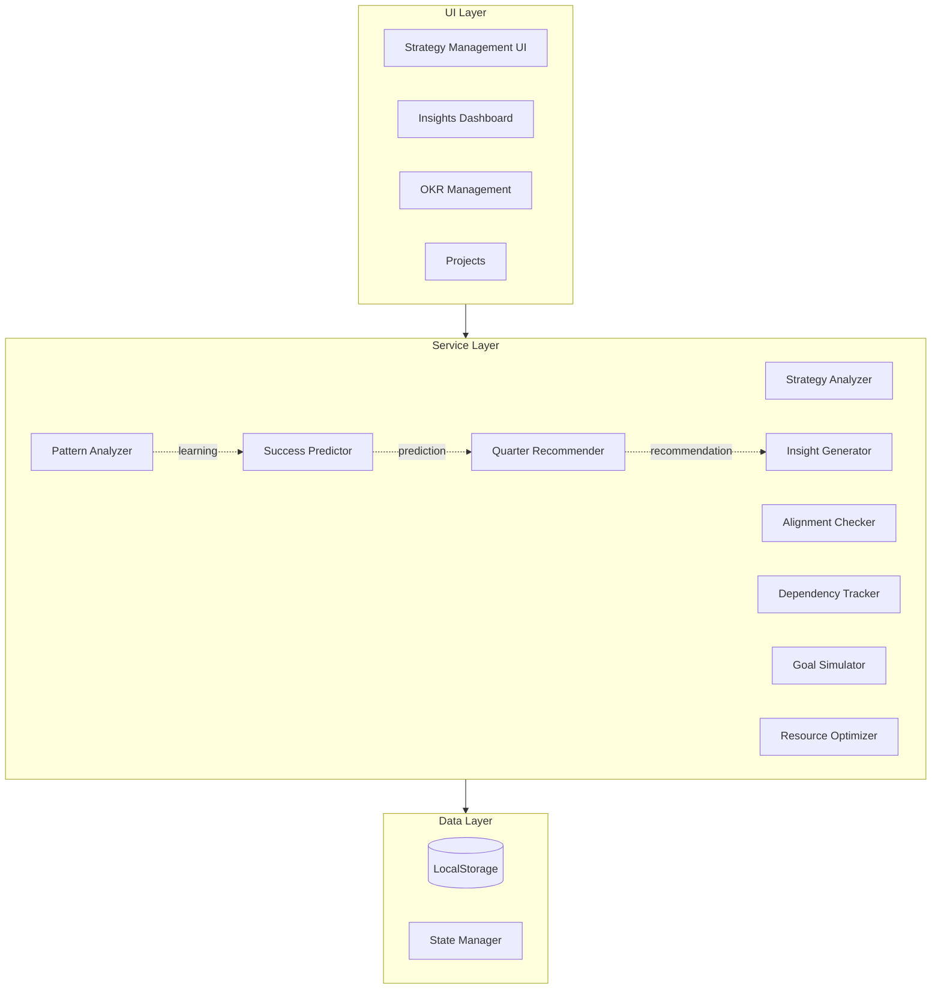
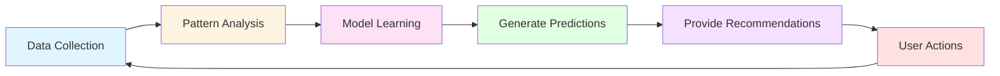
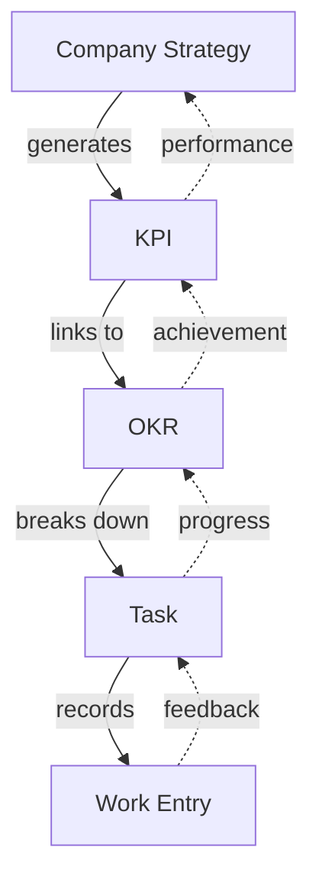
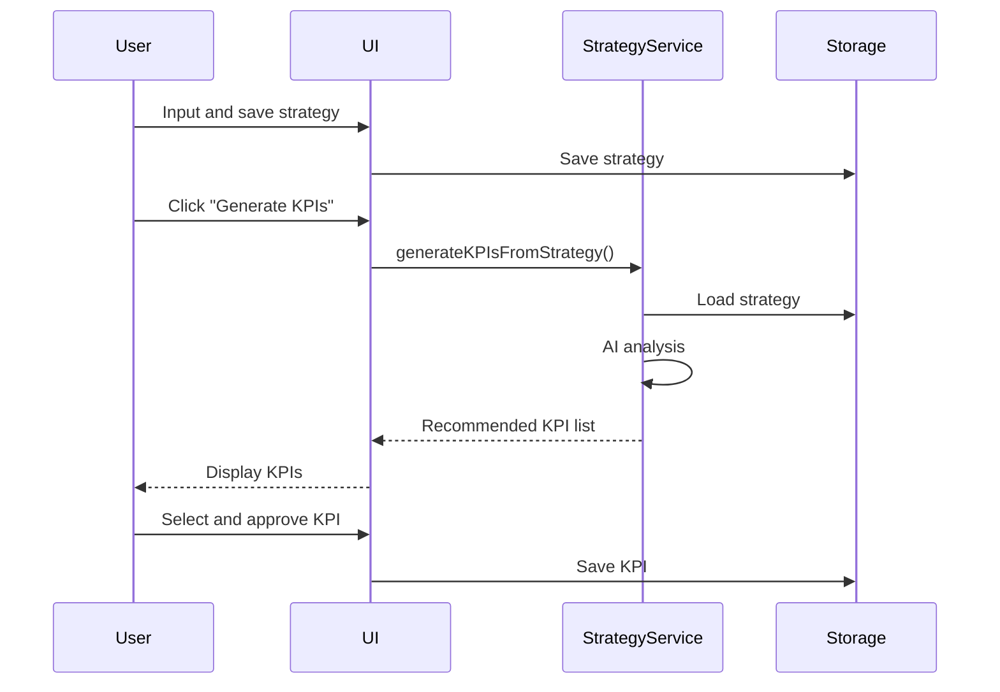
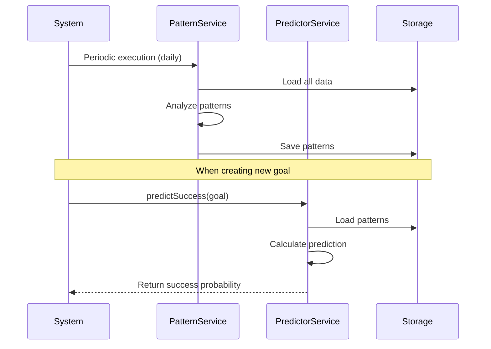
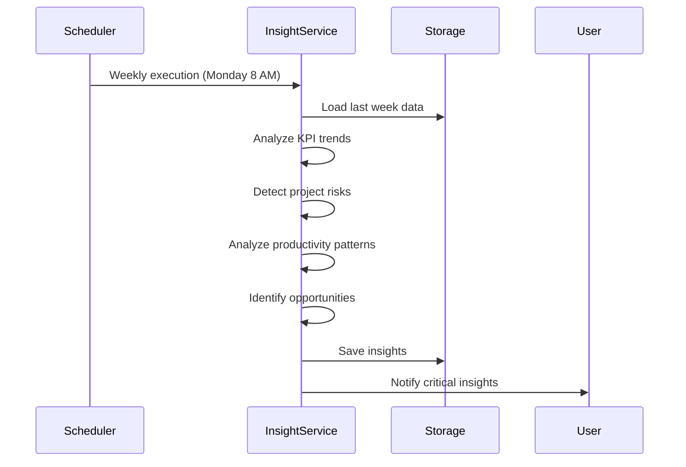

# Strategic Growth System - Technical Documentation

**Version**: 1.0  
**Date**: December 30, 2024  
**Project**: Proce - Strategic Growth System

---

## Table of Contents

1. [System Architecture](#system-architecture)
2. [Core Concepts](#core-concepts)
3. [File Structure](#file-structure)
4. [Service Reference](#service-reference)
5. [Type System](#type-system)
6. [UI Components](#ui-components)
7. [Data Flow](#data-flow)
8. [Developer Guide](#developer-guide)
9. [FAQ](#faq)

---

## System Architecture

### Overall Architecture



### Learning Cycle Architecture



### Data Hierarchy



---

## Core Concepts

### 1. Strategic Alignment

State where all goals are connected to higher-level strategy:

```
Vision → Strategy → KPI → OKR → Task → Work Entry
```

**Alignment Score Calculation**:
```typescript
alignmentScore = (connected goals / total goals) * 100
```

### 2. Pattern Learning

Automatically learn success/failure patterns from historical data:

- **Success Patterns**: Common characteristics of high-achievement goals
- **Failure Patterns**: Repeatedly appearing failure factors
- **Time Patterns**: Optimal work times, seasonality
- **Team Patterns**: Effective team composition, collaboration methods

### 3. Prediction Model

Predict achievability of new goals in advance:

```typescript
successProbability = 
  historicalSuccessRate * 0.4 +
  teamCapability * 0.3 +
  resourceAvailability * 0.3
```

### 4. Insight Generation

Transform data analysis results into actionable insights:

- **Performance**: Measure performance and trends
- **Risk**: Early warning of risk factors
- **Opportunity**: Capture growth opportunities
- **Pattern**: Discover behavioral patterns

---

## File Structure

### Directory Structure

```
src/
├── app/
│   ├── admin/
│   │   └── company-strategy/     # Company Strategy Management UI
│   │       └── page.tsx
│   └── insights/                  # Insights Dashboard UI
│       └── page.tsx
│
├── services/
│   ├── strategy/                  # Strategy Services
│   │   └── strategyAnalyzer.service.ts
│   ├── analytics/                 # Analytics Services
│   │   ├── patternAnalyzer.service.ts
│   │   └── successPredictor.service.ts
│   ├── ai/                        # AI Recommendation Services
│   │   └── nextQuarterRecommendation.service.ts
│   ├── insights/                  # Insight Services
│   │   └── insightGenerator.service.ts
│   ├── alignment/                 # Alignment Check Services
│   │   └── alignmentChecker.service.ts
│   ├── team/                      # Team Collaboration Services
│   │   └── dependencyTracker.service.ts
│   ├── simulation/                # Simulation Services
│   │   └── goalSimulator.service.ts
│   └── optimization/              # Optimization Services
│       └── resourceOptimizer.service.ts
│
└── types/
    └── strategy.types.ts          # Strategy Type Definitions
```

### Key Files Description

| File | Role | Key Functions |
|------|------|---------------|
| `strategyAnalyzer.service.ts` | Strategy Analysis | KPI generation, health assessment |
| `patternAnalyzer.service.ts` | Pattern Analysis | Success/failure pattern learning |
| `successPredictor.service.ts` | Success Prediction | Achievability prediction |
| `nextQuarterRecommendation.service.ts` | Quarter Recommendation | Next quarter goal generation |
| `insightGenerator.service.ts` | Insight Generation | Weekly/monthly/quarterly insights |
| `alignmentChecker.service.ts` | Alignment Check | Strategy alignment analysis |
| `dependencyTracker.service.ts` | Dependency Management | Inter-department dependency tracking |
| `goalSimulator.service.ts` | Simulation | What-if analysis |
| `resourceOptimizer.service.ts` | Resource Optimization | Optimal allocation calculation |

---

## Service Reference

### 1. Strategy Analyzer Service

**Location**: `src/services/strategy/strategyAnalyzer.service.ts`

#### Main Methods

##### `generateKPIsFromStrategy()`

Automatically generate KPIs from strategy.

```typescript
async generateKPIsFromStrategy(
  strategy: CompanyStrategy
): Promise<StrategyToKPIRecommendation>
```

**Input**:
- `strategy`: Company strategy object

**Output**:
```typescript
{
  strategyId: string
  strategyTitle: string
  suggestedKPIs: SuggestedKPI[]
  generatedAt: string
  confidence: number  // 0-1
}
```

**Algorithm**:
1. Generate KPIs based on annual goals (revenue, growth rate)
2. Generate KPIs per strategic priority
3. Generate KPIs based on market position (customer acquisition, market share)
4. Calculate and sort priority scores

**Usage Example**:
```typescript
import { strategyAnalyzerService } from '@/services/strategy/strategyAnalyzer.service'

const strategy = storage.get<CompanyStrategy>('company_strategy')
const recommendations = await strategyAnalyzerService
  .generateKPIsFromStrategy(strategy)

console.log(`Generated ${recommendations.suggestedKPIs.length} KPIs`)
```

##### `analyzeStrategy()`

Analyze strategy health.

```typescript
async analyzeStrategy(
  strategy: CompanyStrategy
): Promise<StrategyAnalysisResult>
```

**Output**:
```typescript
{
  healthScore: number  // 0-100
  strengths: string[]
  weaknesses: string[]
  gaps: string[]
  recommendations: {
    type: string
    title: string
    description: string
    priority: 'high' | 'medium' | 'low'
    estimatedImpact: string
  }[]
  kpiCoverage: Array<{
    category: KPICategory
    covered: boolean
    currentKPIs: number
    suggestedKPIs: number
  }>
}
```

---

### 2. Pattern Analyzer Service

**Location**: `src/services/analytics/patternAnalyzer.service.ts`

#### Main Methods

##### `analyzeAllPatterns()`

Analyze all patterns.

```typescript
async analyzeAllPatterns(): Promise<ExecutionPattern>
```

**Output**:
```typescript
{
  successPatterns: SuccessPattern[]
  failurePatterns: FailurePattern[]
  timePatterns: TimePattern
  teamPatterns: TeamPattern
}
```

**Analysis Items**:

1. **Success Patterns**:
   - Characteristics of completed projects
   - Common traits of high-achievement OKRs
   - Consistent work execution patterns
   - Effective collaboration methods

2. **Failure Patterns**:
   - Delayed project patterns
   - Low-achievement OKR characteristics
   - Irregular work patterns

3. **Time Patterns**:
   - Performance by day of week
   - Optimal start time
   - Average duration
   - Seasonality

4. **Team Patterns**:
   - Optimal team size
   - Critical roles
   - Collaboration score
   - Top performers

**Usage Example**:
```typescript
import { patternAnalyzerService } from '@/services/analytics/patternAnalyzer.service'

const patterns = await patternAnalyzerService.analyzeAllPatterns()

patterns.successPatterns.forEach(pattern => {
  console.log(`Success Pattern: ${pattern.pattern}`)
  console.log(`Confidence: ${pattern.confidence * 100}%`)
})
```

##### `predictAchievability()`

Predict OKR achievability.

```typescript
async predictAchievability(
  objective: Objective
): Promise<AchievabilityPrediction>
```

**Output**:
```typescript
{
  achievabilityScore: number  // 0-100
  confidence: number  // 0-1
  basedOn: {
    historicalSuccessRate: number
    similarObjectives: number
    teamCapability: number
    resourceAvailability: number
  }
  risks: Risk[]
  recommendations: string[]
}
```

---

### 3. Success Predictor Service

**Location**: `src/services/analytics/successPredictor.service.ts`

#### Main Methods

##### `predictProjectSuccess()`

Predict project success probability.

```typescript
async predictProjectSuccess(
  project: Project
): Promise<SuccessPrediction>
```

**Prediction Algorithm**:
```typescript
successProbability = 
  similarProjectsSuccessRate * 0.4 +
  (currentProgress / timeProgress) * 0.3 +
  recentActivityBonus * 0.2 +
  teamSizeBonus * 0.1
```

**Usage Example**:
```typescript
import { successPredictorService } from '@/services/analytics/successPredictor.service'

const prediction = await successPredictorService
  .predictProjectSuccess(project)

if (prediction.successProbability < 0.6) {
  console.warn('Project at risk: Action needed')
  prediction.suggestedActions.forEach(action => {
    console.log(`- ${action.title}`)
  })
}
```

##### `predictOKRSuccess()`

Predict OKR achievability.

```typescript
async predictOKRSuccess(
  objective: Objective
): Promise<SuccessPrediction>
```

##### `predictKPISuccess()`

Predict KPI target achievement.

```typescript
async predictKPISuccess(
  kpi: KPI
): Promise<SuccessPrediction>
```

---

### 4. Next Quarter Recommendation Service

**Location**: `src/services/ai/nextQuarterRecommendation.service.ts`

#### Main Methods

##### `generateNextQuarterRecommendations()`

Automatically generate next quarter goals.

```typescript
async generateNextQuarterRecommendations(): 
  Promise<NextQuarterRecommendation>
```

**Output**:
```typescript
{
  quarter: string  // "Q1 2025"
  generatedAt: string
  confidence: number
  
  currentQuarter: {
    period: string
    achievements: string[]
    lessons: string[]
    bottlenecks: string[]
    keyMetrics: {
      kpiAchievementRate: number
      okrCompletionRate: number
      projectSuccessRate: number
      teamProductivity: number
    }
  }
  
  nextQuarter: {
    suggestedKPIs: SuggestedKPIWithContext[]
    suggestedOKRs: SuggestedOKRWithContext[]
    strategicFocus: {
      whatToDouble: FocusArea[]
      whatToStop: FocusArea[]
      newInitiatives: FocusArea[]
    }
    resourceAllocation: ResourceRecommendation[]
  }
}
```

**Recommendation Logic**:
1. Analyze current quarter performance
2. Pattern-based learning
3. Select continuing KPIs (adjust targets)
4. Propose new KPIs (补充 gaps)
5. Determine strategic focus

**Usage Example**:
```typescript
import { nextQuarterRecommendationService } from '@/services/ai/nextQuarterRecommendation.service'

// Run at quarter-end
const recommendations = await nextQuarterRecommendationService
  .generateNextQuarterRecommendations()

console.log('Current Quarter Performance:')
recommendations.currentQuarter.achievements.forEach(a => 
  console.log(`✓ ${a}`)
)

console.log('\nNext Quarter Recommendations:')
recommendations.nextQuarter.suggestedKPIs.forEach(kpi => {
  console.log(`- ${kpi.kpi.name}: ${kpi.adjustmentFromCurrent}`)
})
```

---

### 5. Insight Generator Service

**Location**: `src/services/insights/insightGenerator.service.ts`

#### Main Methods

##### `generateWeeklyInsights()`

Generate weekly insights.

```typescript
async generateWeeklyInsights(): Promise<InsightCollection>
```

##### `generateMonthlyInsights()`

Generate monthly insights.

```typescript
async generateMonthlyInsights(): Promise<InsightCollection>
```

##### `generateQuarterlyInsights()`

Generate quarterly insights.

```typescript
async generateQuarterlyInsights(): Promise<InsightCollection>
```

**Output Structure**:
```typescript
{
  period: 'weekly' | 'monthly' | 'quarterly'
  periodLabel: string
  insights: Insight[]
  summary: {
    total: number
    byType: {
      performance: number
      risk: number
      opportunity: number
      pattern: number
    }
    byPriority: {
      critical: number
      high: number
      medium: number
      low: number
    }
  }
  generatedAt: string
}
```

**Insight Structure**:
```typescript
{
  id: string
  type: 'performance' | 'risk' | 'opportunity' | 'pattern'
  period: 'weekly' | 'monthly' | 'quarterly'
  priority: 'critical' | 'high' | 'medium' | 'low'
  
  title: string
  description: string
  
  metrics: {
    current: number
    previous: number
    change: number  // percentage
    changeLabel: string
  }
  
  impact: string
  suggestedActions: string[]
  relatedItems: Array<{
    type: 'kpi' | 'okr' | 'project' | 'task'
    id: string
    name: string
  }>
  
  generatedAt: string
  expiresAt?: string
}
```

**Usage Example**:
```typescript
import { insightGeneratorService } from '@/services/insights/insightGenerator.service'

// Generate weekly insights (recommend auto-run every Monday)
const weeklyInsights = await insightGeneratorService
  .generateWeeklyInsights()

// Filter critical insights
const criticalInsights = weeklyInsights.insights
  .filter(i => i.priority === 'critical')

// Send notifications
criticalInsights.forEach(insight => {
  sendNotification({
    title: insight.title,
    message: insight.description,
    actions: insight.suggestedActions
  })
})
```

---

### 6. Alignment Checker Service

**Location**: `src/services/alignment/alignmentChecker.service.ts`

#### Main Methods

##### `checkAlignment()`

Check Strategy-KPI-OKR alignment.

```typescript
async checkAlignment(): Promise<AlignmentResult>
```

**Output**:
```typescript
{
  overallScore: number  // 0-100
  strategyToKPI: number  // Strategy→KPI alignment
  kpiToOKR: number  // KPI→OKR alignment
  orphanOKRs: Objective[]  // Unlinked OKRs
  unlinkedKPIs: KPI[]  // Unlinked KPIs
  recommendations: string[]
}
```

**Usage Example**:
```typescript
import { alignmentCheckerService } from '@/services/alignment/alignmentChecker.service'

const alignment = await alignmentCheckerService.checkAlignment()

if (alignment.overallScore < 70) {
  console.warn('Low strategy alignment')
  
  if (alignment.orphanOKRs.length > 0) {
    console.log(`${alignment.orphanOKRs.length} orphan OKRs:`)
    alignment.orphanOKRs.forEach(okr => {
      console.log(`- ${okr.title}`)
    })
  }
}
```

---

### 7. Dependency Tracker Service

**Location**: `src/services/team/dependencyTracker.service.ts`

#### Main Methods

##### `analyzeDependencies()`

Analyze inter-department dependencies.

```typescript
async analyzeDependencies(): Promise<DepartmentDependency[]>
```

**Output**:
```typescript
{
  fromDepartment: string
  toDepartment: string
  type: 'blocks' | 'enables' | 'supports'
  relatedObjectives: Array<{
    fromObjectiveId: string
    toObjectiveId: string
    criticality: 'critical' | 'important' | 'nice-to-have'
  }>
  status: 'on-track' | 'at-risk' | 'blocked'
  bottlenecks?: Array<{
    description: string
    impact: string
    suggestedResolution: string
  }>
}
```

##### `detectBottlenecks()`

Detect bottleneck departments.

```typescript
async detectBottlenecks(): Promise<string[]>
```

---

### 8. Goal Simulator Service

**Location**: `src/services/simulation/goalSimulator.service.ts`

#### Main Methods

##### `simulateScenario()`

Simulate goal achievement scenarios.

```typescript
async simulateScenario(
  targetType: 'project' | 'okr' | 'kpi',
  targetId: string,
  changes: Array<{
    type: 'resource' | 'timeline' | 'scope' | 'team'
    description: string
    value: any
  }>
): Promise<SimulationScenario>
```

**Output**:
```typescript
{
  name: string
  changes: ChangeItem[]
  
  predictedOutcome: {
    successProbability: number
    expectedCompletion: Date
    estimatedCost: number
    riskLevel: 'low' | 'medium' | 'high'
    impact: {
      onKPIs: Array<{kpiId: string; change: number}>
      onOKRs: Array<{okrId: string; change: number}>
      onTeam: string
    }
  }
  
  recommendations: {
    shouldProceed: boolean
    alternatives: string[]
    considerations: string[]
  }
}
```

**Usage Example**:
```typescript
import { goalSimulatorService } from '@/services/simulation/goalSimulator.service'

// Scenario: Add 2 developers
const scenario = await goalSimulatorService.simulateScenario(
  'project',
  projectId,
  [
    {
      type: 'resource',
      description: 'Add 2 developers',
      value: 2
    },
    {
      type: 'timeline',
      description: 'Extend 2 weeks',
      value: 14
    }
  ]
)

console.log(`Success Probability: ${scenario.predictedOutcome.successProbability * 100}%`)
console.log(`Estimated Cost: ${scenario.predictedOutcome.estimatedCost} KRW`)
console.log(`Recommend Proceeding: ${scenario.recommendations.shouldProceed ? 'Yes' : 'No'}`)
```

---

### 9. Resource Optimizer Service

**Location**: `src/services/optimization/resourceOptimizer.service.ts`

#### Main Methods

##### `optimizeResources()`

Calculate optimal resource allocation.

```typescript
async optimizeResources(): Promise<ResourceAllocation>
```

**Output**:
```typescript
{
  departments: Array<{
    departmentId: string
    currentResources: {
      headcount: number
      budget: number
      time: number
    }
    optimalAllocation: {
      headcount: number
      budget: number
      expectedImpact: {
        kpiImprovements: Array<{kpiId: string; improvement: number}>
        okrCompletionRate: number
      }
    }
    adjustmentNeeded: {
      action: 'increase' | 'maintain' | 'decrease'
      reasoning: string
      priority: number
    }
  }>
  
  reallocationSuggestions: Array<{
    from: string
    to: string
    resource: 'budget' | 'headcount'
    amount: number
    expectedROI: number
    reasoning: string
  }>
}
```

---

## Type System

### Strategy Types

**Location**: `src/types/strategy.types.ts`

#### Core Types

##### `CompanyStrategy`

```typescript
interface CompanyStrategy {
  id: string
  
  // Core Strategy
  vision: string
  mission: string
  coreValues: string[]
  
  // Strategic Priorities
  strategicPriorities: StrategicPriority[]
  
  // Market Position
  marketPosition: MarketPosition
  
  // Annual Goals
  annualGoals: AnnualGoal[]
  
  // Metadata
  createdAt: string
  updatedAt: string
  createdBy: string
}
```

##### `StrategicPriority`

```typescript
interface StrategicPriority {
  id: string
  title: string
  description: string
  timeframe: 'short' | 'mid' | 'long'  // 1yr/3yr/5yr
  targetMetrics: string[]
  status: 'active' | 'achieved' | 'discontinued'
  startDate?: string
  targetDate?: string
  progress?: number  // 0-100
  owner?: string
  ownerId?: string
}
```

##### `SuggestedKPI`

```typescript
interface SuggestedKPI {
  id: string
  name: string
  description: string
  category: KPICategory
  
  // Recommendation Rationale
  reasoning: string
  alignmentScore: number  // 0-1
  priorityScore: number  // 0-1
  
  // Target Setting
  suggestedTarget: number
  suggestedUnit: string
  suggestedPeriod: 'quarter' | 'year'
  
  // Responsible Departments
  suggestedDepartments: string[]
  suggestedOwner?: string
  
  // Linked Strategies
  linkedStrategies: string[]
  
  // Acceptance Status
  status: 'pending' | 'accepted' | 'rejected' | 'modified'
}
```

---

## UI Components

### 1. Company Strategy Page

**Route**: `/app/admin/company-strategy`  
**File**: `src/app/admin/company-strategy/page.tsx`

#### Key Features

1. **Strategy Input Form**
   - Vision/Mission text areas
   - Add/remove core values
   - Toggle edit mode

2. **AI Analysis**
   - Strategy health score (0-100)
   - Strengths/weaknesses lists
   - Recommendation cards

3. **Auto-Generate KPIs**
   - AI-recommended KPI list
   - Display alignment scores
   - Individual approval/creation

#### Usage Flow

```typescript
// 1. Load strategy
const strategy = storage.get<CompanyStrategy>('company_strategy')

// 2. Analyze strategy
const analysis = await strategyAnalyzerService.analyzeStrategy(strategy)

// 3. Generate KPIs
const recommendations = await strategyAnalyzerService
  .generateKPIsFromStrategy(strategy)

// 4. Accept KPI
const handleAcceptKPI = (kpiId: string) => {
  const kpi = convertToKPI(recommendations.suggestedKPIs.find(k => k.id === kpiId))
  storage.set('kpis', [...storage.get('kpis', []), kpi])
}
```

---

### 2. Insights Page

**Route**: `/app/insights`  
**File**: `src/app/insights/page.tsx`

#### Key Features

1. **Period Selection**
   - Weekly/Monthly/Quarterly tabs

2. **Summary Cards**
   - Total insights count
   - Type breakdown (performance/risk/opportunity/pattern)
   - Priority breakdown

3. **Insight List**
   - Type-specific icons and colors
   - Metric change visualization
   - Recommended actions list
   - Related items tags

#### Usage Flow

```typescript
// 1. Generate insights
const [period, setPeriod] = useState<'weekly' | 'monthly' | 'quarterly'>('weekly')

const generateInsights = async () => {
  let insights: InsightCollection
  
  switch (period) {
    case 'weekly':
      insights = await insightGeneratorService.generateWeeklyInsights()
      break
    case 'monthly':
      insights = await insightGeneratorService.generateMonthlyInsights()
      break
    case 'quarterly':
      insights = await insightGeneratorService.generateQuarterlyInsights()
      break
  }
  
  setInsights(insights)
}

// 2. Sort by priority
const sortedInsights = insights.insights.sort((a, b) => {
  const priority = { critical: 0, high: 1, medium: 2, low: 3 }
  return priority[a.priority] - priority[b.priority]
})
```

---

## Data Flow

### 1. Strategy → KPI Generation Flow



### 2. Pattern Learning → Prediction Flow



### 3. Insight Generation Flow



---

## Developer Guide

### Installation & Setup

#### 1. Install Dependencies

```bash
npm install
```

#### 2. Type Check

```bash
npm run type-check
```

#### 3. Build

```bash
npm run build
```

---

### Adding New Services

#### 1. Create Service File

```typescript
// src/services/myfeature/myService.service.ts

export class MyService {
  /**
   * Service description
   */
  async myMethod(): Promise<MyResult> {
    // Implementation
  }
}

// Singleton instance
export const myService = new MyService()
```

#### 2. Define Types

```typescript
// src/types/myfeature.types.ts

export interface MyResult {
  // Field definitions
}
```

#### 3. UI Integration

```typescript
// src/app/mypage/page.tsx

import { myService } from '@/services/myfeature/myService.service'

export default function MyPage() {
  const handleAction = async () => {
    const result = await myService.myMethod()
    // Process result
  }
  
  return <div>...</div>
}
```

---

### Data Storage & Loading

#### Using LocalStorage

```typescript
import { storage } from '@/utils/storage'

// Save
storage.set('my_data', { value: 123 })

// Load
const data = storage.get<MyType>('my_data', defaultValue)

// Remove
storage.remove('my_data')
```

#### Recommended Key Naming

```typescript
// Strategy related
'company_strategy'
'okr_ai_recommendations'
'ai_recommendations'

// Data
'kpis'
'objectives'
'projects'
'workEntries'

// Analysis results
'execution_patterns'
'success_predictions'
'next_quarter_recommendations'
```

---

### AI Service Usage Patterns

#### Pattern 1: Analyze Then Recommend

```typescript
// 1. Load data
const data = storage.get('workEntries', [])

// 2. Analyze patterns
const patterns = await patternAnalyzerService.analyzeAllPatterns()

// 3. Generate recommendations
const recommendations = generateRecommendations(patterns)

// 4. Display in UI
setRecommendations(recommendations)
```

#### Pattern 2: Predict Then Decide

```typescript
// 1. Run prediction
const prediction = await successPredictorService.predictProjectSuccess(project)

// 2. Assess risk
if (prediction.successProbability < 0.6) {
  // 3. Simulate
  const scenarios = await simulateAlternatives(project)
  
  // 4. Suggest best alternative
  const bestScenario = findBestScenario(scenarios)
  presentToUser(bestScenario)
}
```

#### Pattern 3: Periodic Insights

```typescript
// Periodic execution (e.g., every Monday)
const runWeeklyAnalysis = async () => {
  // 1. Generate insights
  const insights = await insightGeneratorService.generateWeeklyInsights()
  
  // 2. Filter critical insights
  const critical = insights.insights.filter(i => i.priority === 'critical')
  
  // 3. Send notifications
  critical.forEach(insight => {
    notificationService.send({
      title: insight.title,
      message: insight.description,
      actions: insight.suggestedActions
    })
  })
  
  // 4. Save
  storage.set('latest_insights', insights)
}
```

---

### Performance Optimization

#### 1. Batch Processing

For large data processing:

```typescript
// Bad
for (const item of items) {
  await processItem(item)  // Sequential processing
}

// Good
await Promise.all(
  items.map(item => processItem(item))  // Parallel processing
)
```

#### 2. Caching

For frequently used data:

```typescript
class MyService {
  private cache: Map<string, any> = new Map()
  
  async getData(key: string) {
    if (this.cache.has(key)) {
      return this.cache.get(key)
    }
    
    const data = await expensiveOperation(key)
    this.cache.set(key, data)
    return data
  }
}
```

#### 3. Memoization

React components:

```typescript
import { useMemo, useCallback } from 'react'

const MyComponent = () => {
  // Cache calculated results
  const expensiveValue = useMemo(() => {
    return computeExpensiveValue(data)
  }, [data])
  
  // Cache functions
  const handleClick = useCallback(() => {
    doSomething()
  }, [dependency])
  
  return <div>...</div>
}
```

---

### Testing

#### Unit Test Example

```typescript
import { strategyAnalyzerService } from '@/services/strategy/strategyAnalyzer.service'

describe('StrategyAnalyzerService', () => {
  it('should generate KPIs from strategy', async () => {
    const strategy: CompanyStrategy = {
      // Test data
    }
    
    const result = await strategyAnalyzerService
      .generateKPIsFromStrategy(strategy)
    
    expect(result.suggestedKPIs.length).toBeGreaterThan(0)
    expect(result.confidence).toBeGreaterThan(0.5)
  })
})
```

---

## FAQ

### Q1: How to add a new KPI category?

**A**: Add to `KPICategory` type in `src/types/kpi.types.ts`:

```typescript
export type KPICategory = 
  | 'revenue'
  | 'growth'
  | 'customer'
  | 'product'
  | 'operations'
  | 'team'
  | 'quality'
  | 'efficiency'
  | 'your_new_category'  // Add
```

Then add mapping logic to `determineCategoryFromPriority()` method in `strategyAnalyzer.service.ts`.

---

### Q2: How to change insight generation frequency?

**A**: Configure scheduler or manual invocation:

```typescript
// Run daily
setInterval(async () => {
  const insights = await insightGeneratorService.generateWeeklyInsights()
  // Process
}, 24 * 60 * 60 * 1000)  // 24 hours
```

---

### Q3: How to improve prediction accuracy?

**A**: 
1. Collect more historical data
2. Improve pattern analysis algorithms
3. Adjust weights:

```typescript
// successPredictor.service.ts
successProbability = 
  historicalSuccessRate * 0.5 +  // Increase weight
  teamCapability * 0.3 +
  resourceAvailability * 0.2
```

---

### Q4: How to add custom analysis logic?

**A**: Create new service:

```typescript
// src/services/analytics/customAnalyzer.service.ts

export class CustomAnalyzerService {
  async analyzeCustomMetric(): Promise<CustomResult> {
    // Custom logic
  }
}

export const customAnalyzerService = new CustomAnalyzerService()
```

Then call from existing service:

```typescript
import { customAnalyzerService } from './customAnalyzer.service'

// Inside insightGenerator.service.ts
const customInsights = await customAnalyzerService.analyzeCustomMetric()
insights.push(...customInsights)
```

---

### Q5: Precautions for large data processing?

**A**:
1. Use **pagination**
2. Apply **filtering** first
3. Use **batch processing**
4. Utilize **caching**

```typescript
// Large dataset processing example
const processLargeDataset = async (data: any[]) => {
  const BATCH_SIZE = 100
  
  for (let i = 0; i < data.length; i += BATCH_SIZE) {
    const batch = data.slice(i, i + BATCH_SIZE)
    await processBatch(batch)
    
    // Memory cleanup
    if (i % 1000 === 0) {
      await new Promise(resolve => setTimeout(resolve, 100))
    }
  }
}
```

---

## References

### External Libraries

- **date-fns**: Date handling
- **lucide-react**: Icons
- **sonner**: Toast notifications

### Related Documentation

- [Planning Document](./STRATEGIC_GROWTH_SYSTEM_PLANNING_EN.md)
- [Project README](../README.md)

---

**Document Version**: 1.0  
**Last Updated**: December 30, 2024  
**Author**: Proce Development Team

