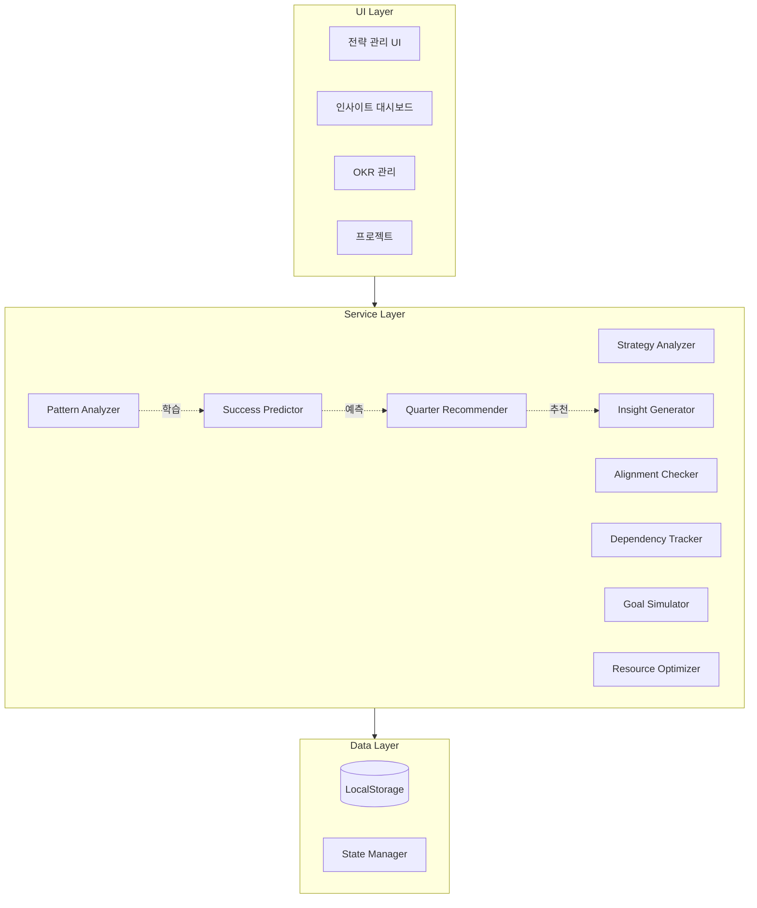
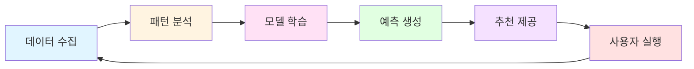
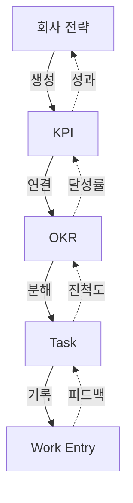
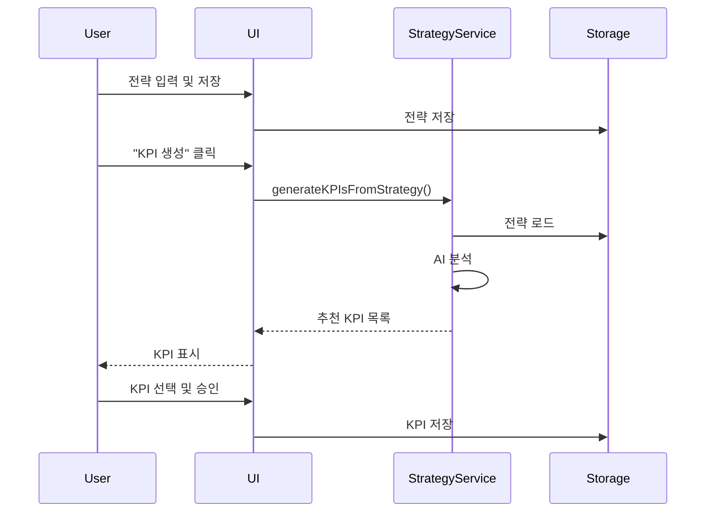
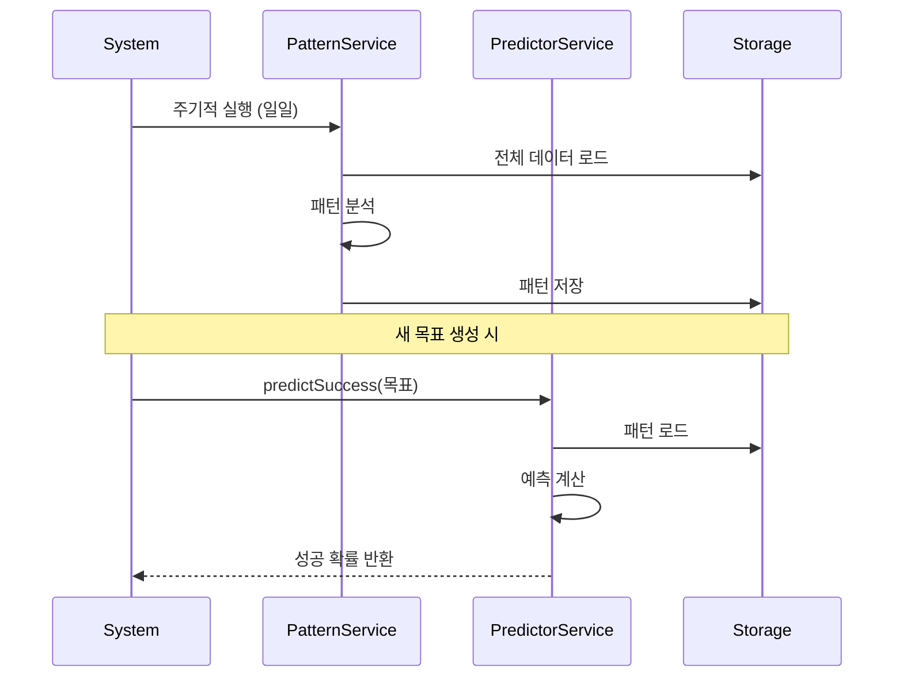
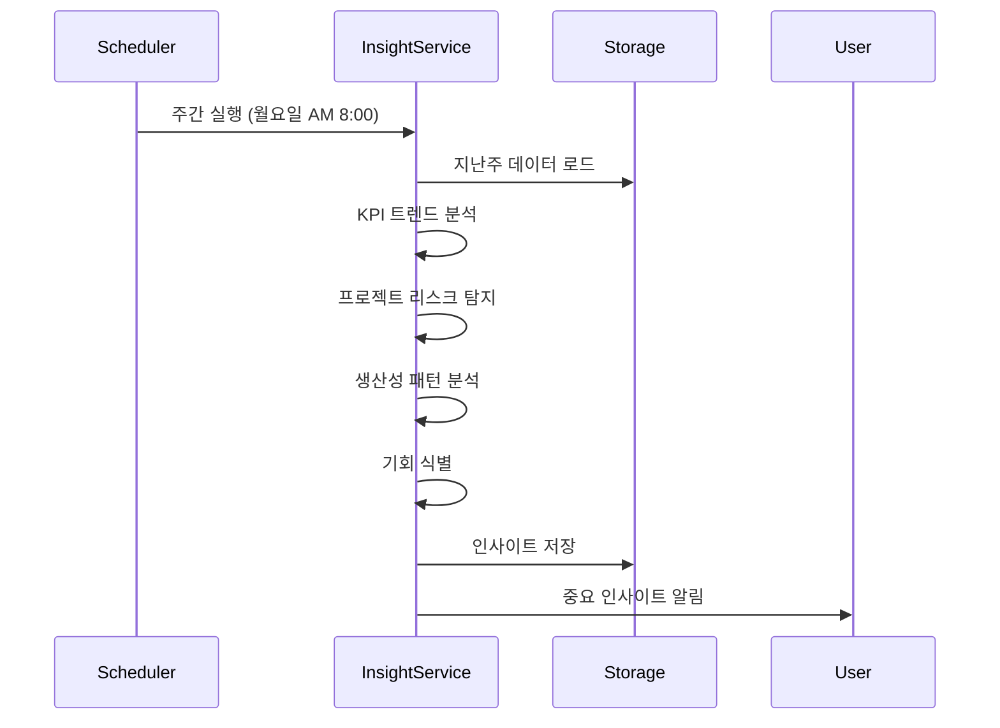

# 전략적 성장 시스템 기술 문서

**버전**: 1.0  
**작성일**: 2024-12-30  
**프로젝트**: Proce - Strategic Growth System

---

## 목차

1. [시스템 아키텍처](#시스템-아키텍처)
2. [핵심 개념](#핵심-개념)
3. [파일 구조](#파일-구조)
4. [서비스 레퍼런스](#서비스-레퍼런스)
5. [타입 시스템](#타입-시스템)
6. [UI 컴포넌트](#ui-컴포넌트)
7. [데이터 플로우](#데이터-플로우)
8. [개발자 가이드](#개발자-가이드)
9. [FAQ](#faq)

---

## 시스템 아키텍처

### 전체 아키텍처



### 학습 사이클 아키텍처



### 데이터 계층 구조



---

## 핵심 개념

### 1. 전략적 정렬 (Strategic Alignment)

모든 목표가 상위 전략과 연결되어 있는 상태:

```
비전 → 전략 → KPI → OKR → Task → Work Entry
```

**정렬도 점수 계산**:
```typescript
alignmentScore = (연결된 목표 수 / 전체 목표 수) * 100
```

### 2. 패턴 학습 (Pattern Learning)

과거 데이터로부터 성공/실패 패턴을 자동 학습:

- **성공 패턴**: 높은 달성률을 보인 목표의 공통 특징
- **실패 패턴**: 반복적으로 나타나는 실패 요인
- **시간 패턴**: 최적의 작업 시간, 계절성
- **팀 패턴**: 효과적인 팀 구성, 협업 방식

### 3. 예측 모델 (Prediction Model)

새로운 목표의 달성 가능성을 사전 예측:

```typescript
successProbability = 
  historicalSuccessRate * 0.4 +
  teamCapability * 0.3 +
  resourceAvailability * 0.3
```

### 4. 인사이트 생성 (Insight Generation)

데이터 분석 결과를 실행 가능한 인사이트로 변환:

- **Performance**: 성과 측정 및 추세
- **Risk**: 위험 요소 조기 경고
- **Opportunity**: 성장 기회 포착
- **Pattern**: 행동 패턴 발견

---

## 파일 구조

### 디렉토리 구조

```
src/
├── app/
│   ├── admin/
│   │   └── company-strategy/     # 회사 전략 관리 UI
│   │       └── page.tsx
│   └── insights/                  # 인사이트 대시보드 UI
│       └── page.tsx
│
├── services/
│   ├── strategy/                  # 전략 관련 서비스
│   │   └── strategyAnalyzer.service.ts
│   ├── analytics/                 # 분석 서비스
│   │   ├── patternAnalyzer.service.ts
│   │   └── successPredictor.service.ts
│   ├── ai/                        # AI 추천 서비스
│   │   └── nextQuarterRecommendation.service.ts
│   ├── insights/                  # 인사이트 서비스
│   │   └── insightGenerator.service.ts
│   ├── alignment/                 # 정렬 체크 서비스
│   │   └── alignmentChecker.service.ts
│   ├── team/                      # 팀 협업 서비스
│   │   └── dependencyTracker.service.ts
│   ├── simulation/                # 시뮬레이션 서비스
│   │   └── goalSimulator.service.ts
│   └── optimization/              # 최적화 서비스
│       └── resourceOptimizer.service.ts
│
└── types/
    └── strategy.types.ts          # 전략 관련 타입 정의
```

### 주요 파일 설명

| 파일 | 역할 | 주요 기능 |
|------|------|----------|
| `strategyAnalyzer.service.ts` | 전략 분석 | KPI 생성, 건강도 평가 |
| `patternAnalyzer.service.ts` | 패턴 분석 | 성공/실패 패턴 학습 |
| `successPredictor.service.ts` | 성공 예측 | 달성 가능성 예측 |
| `nextQuarterRecommendation.service.ts` | 분기 추천 | 다음 분기 목표 생성 |
| `insightGenerator.service.ts` | 인사이트 생성 | 주/월/분기 인사이트 |
| `alignmentChecker.service.ts` | 정렬 체크 | 전략 정렬도 분석 |
| `dependencyTracker.service.ts` | 의존성 관리 | 부서 간 의존성 추적 |
| `goalSimulator.service.ts` | 시뮬레이션 | What-if 분석 |
| `resourceOptimizer.service.ts` | 리소스 최적화 | 최적 배분 계산 |

---

## 서비스 레퍼런스

### 1. Strategy Analyzer Service

**위치**: `src/services/strategy/strategyAnalyzer.service.ts`

#### 주요 메서드

##### `generateKPIsFromStrategy()`

전략으로부터 KPI를 자동 생성합니다.

```typescript
async generateKPIsFromStrategy(
  strategy: CompanyStrategy
): Promise<StrategyToKPIRecommendation>
```

**입력**:
- `strategy`: 회사 전략 객체

**출력**:
```typescript
{
  strategyId: string
  strategyTitle: string
  suggestedKPIs: SuggestedKPI[]
  generatedAt: string
  confidence: number  // 0-1
}
```

**알고리즘**:
1. 연간 목표 기반 KPI 생성 (매출, 성장률)
2. 전략적 우선순위별 KPI 생성
3. 시장 포지션 기반 KPI 생성 (고객 확보, 시장 점유율)
4. 우선순위 점수 계산 및 정렬

**사용 예제**:
```typescript
import { strategyAnalyzerService } from '@/services/strategy/strategyAnalyzer.service'

const strategy = storage.get<CompanyStrategy>('company_strategy')
const recommendations = await strategyAnalyzerService
  .generateKPIsFromStrategy(strategy)

console.log(`${recommendations.suggestedKPIs.length}개 KPI 생성됨`)
```

##### `analyzeStrategy()`

전략의 건강도를 분석합니다.

```typescript
async analyzeStrategy(
  strategy: CompanyStrategy
): Promise<StrategyAnalysisResult>
```

**출력**:
```typescript
{
  healthScore: number  // 0-100
  strengths: string[]
  weaknesses: string[]
  gaps: string[]
  recommendations: {
    type: string
    title: string
    description: string
    priority: 'high' | 'medium' | 'low'
    estimatedImpact: string
  }[]
  kpiCoverage: Array<{
    category: KPICategory
    covered: boolean
    currentKPIs: number
    suggestedKPIs: number
  }>
}
```

---

### 2. Pattern Analyzer Service

**위치**: `src/services/analytics/patternAnalyzer.service.ts`

#### 주요 메서드

##### `analyzeAllPatterns()`

전체 패턴을 분석합니다.

```typescript
async analyzeAllPatterns(): Promise<ExecutionPattern>
```

**출력**:
```typescript
{
  successPatterns: SuccessPattern[]
  failurePatterns: FailurePattern[]
  timePatterns: TimePattern
  teamPatterns: TeamPattern
}
```

**분석 항목**:

1. **성공 패턴**:
   - 완료된 프로젝트 특징
   - 높은 달성률 OKR의 공통점
   - 일관된 업무 수행 패턴
   - 효과적인 협업 방식

2. **실패 패턴**:
   - 지연되는 프로젝트 패턴
   - 낮은 달성률 OKR 특징
   - 불규칙한 업무 패턴

3. **시간 패턴**:
   - 요일별 성과
   - 최적 시작 시간
   - 평균 소요 시간
   - 계절성

4. **팀 패턴**:
   - 최적 팀 크기
   - 핵심 역할
   - 협업 점수
   - 상위 성과자

**사용 예제**:
```typescript
import { patternAnalyzerService } from '@/services/analytics/patternAnalyzer.service'

const patterns = await patternAnalyzerService.analyzeAllPatterns()

patterns.successPatterns.forEach(pattern => {
  console.log(`성공 패턴: ${pattern.pattern}`)
  console.log(`신뢰도: ${pattern.confidence * 100}%`)
})
```

##### `predictAchievability()`

OKR의 달성 가능성을 예측합니다.

```typescript
async predictAchievability(
  objective: Objective
): Promise<AchievabilityPrediction>
```

**출력**:
```typescript
{
  achievabilityScore: number  // 0-100
  confidence: number  // 0-1
  basedOn: {
    historicalSuccessRate: number
    similarObjectives: number
    teamCapability: number
    resourceAvailability: number
  }
  risks: Risk[]
  recommendations: string[]
}
```

---

### 3. Success Predictor Service

**위치**: `src/services/analytics/successPredictor.service.ts`

#### 주요 메서드

##### `predictProjectSuccess()`

프로젝트 성공 확률을 예측합니다.

```typescript
async predictProjectSuccess(
  project: Project
): Promise<SuccessPrediction>
```

**예측 알고리즘**:
```typescript
successProbability = 
  similarProjectsSuccessRate * 0.4 +
  (currentProgress / timeProgress) * 0.3 +
  recentActivityBonus * 0.2 +
  teamSizeBonus * 0.1
```

**사용 예제**:
```typescript
import { successPredictorService } from '@/services/analytics/successPredictor.service'

const prediction = await successPredictorService
  .predictProjectSuccess(project)

if (prediction.successProbability < 0.6) {
  console.warn('프로젝트 위험: 조치 필요')
  prediction.suggestedActions.forEach(action => {
    console.log(`- ${action.title}`)
  })
}
```

##### `predictOKRSuccess()`

OKR 달성 가능성을 예측합니다.

```typescript
async predictOKRSuccess(
  objective: Objective
): Promise<SuccessPrediction>
```

##### `predictKPISuccess()`

KPI 목표 달성을 예측합니다.

```typescript
async predictKPISuccess(
  kpi: KPI
): Promise<SuccessPrediction>
```

---

### 4. Next Quarter Recommendation Service

**위치**: `src/services/ai/nextQuarterRecommendation.service.ts`

#### 주요 메서드

##### `generateNextQuarterRecommendations()`

다음 분기 목표를 자동 생성합니다.

```typescript
async generateNextQuarterRecommendations(): 
  Promise<NextQuarterRecommendation>
```

**출력**:
```typescript
{
  quarter: string  // "Q1 2025"
  generatedAt: string
  confidence: number
  
  currentQuarter: {
    period: string
    achievements: string[]
    lessons: string[]
    bottlenecks: string[]
    keyMetrics: {
      kpiAchievementRate: number
      okrCompletionRate: number
      projectSuccessRate: number
      teamProductivity: number
    }
  }
  
  nextQuarter: {
    suggestedKPIs: SuggestedKPIWithContext[]
    suggestedOKRs: SuggestedOKRWithContext[]
    strategicFocus: {
      whatToDouble: FocusArea[]
      whatToStop: FocusArea[]
      newInitiatives: FocusArea[]
    }
    resourceAllocation: ResourceRecommendation[]
  }
}
```

**추천 로직**:
1. 현재 분기 성과 분석
2. 패턴 기반 학습
3. 지속할 KPI 선별 (목표치 조정)
4. 새로운 KPI 제안 (부족 영역 보완)
5. 전략적 포커스 결정

**사용 예제**:
```typescript
import { nextQuarterRecommendationService } from '@/services/ai/nextQuarterRecommendation.service'

// 분기 말에 실행
const recommendations = await nextQuarterRecommendationService
  .generateNextQuarterRecommendations()

console.log('현재 분기 성과:')
recommendations.currentQuarter.achievements.forEach(a => 
  console.log(`✓ ${a}`)
)

console.log('\n다음 분기 추천:')
recommendations.nextQuarter.suggestedKPIs.forEach(kpi => {
  console.log(`- ${kpi.kpi.name}: ${kpi.adjustmentFromCurrent}`)
})
```

---

### 5. Insight Generator Service

**위치**: `src/services/insights/insightGenerator.service.ts`

#### 주요 메서드

##### `generateWeeklyInsights()`

주간 인사이트를 생성합니다.

```typescript
async generateWeeklyInsights(): Promise<InsightCollection>
```

##### `generateMonthlyInsights()`

월간 인사이트를 생성합니다.

```typescript
async generateMonthlyInsights(): Promise<InsightCollection>
```

##### `generateQuarterlyInsights()`

분기별 인사이트를 생성합니다.

```typescript
async generateQuarterlyInsights(): Promise<InsightCollection>
```

**출력 구조**:
```typescript
{
  period: 'weekly' | 'monthly' | 'quarterly'
  periodLabel: string
  insights: Insight[]
  summary: {
    total: number
    byType: {
      performance: number
      risk: number
      opportunity: number
      pattern: number
    }
    byPriority: {
      critical: number
      high: number
      medium: number
      low: number
    }
  }
  generatedAt: string
}
```

**Insight 구조**:
```typescript
{
  id: string
  type: 'performance' | 'risk' | 'opportunity' | 'pattern'
  period: 'weekly' | 'monthly' | 'quarterly'
  priority: 'critical' | 'high' | 'medium' | 'low'
  
  title: string
  description: string
  
  metrics: {
    current: number
    previous: number
    change: number  // percentage
    changeLabel: string
  }
  
  impact: string
  suggestedActions: string[]
  relatedItems: Array<{
    type: 'kpi' | 'okr' | 'project' | 'task'
    id: string
    name: string
  }>
  
  generatedAt: string
  expiresAt?: string
}
```

**사용 예제**:
```typescript
import { insightGeneratorService } from '@/services/insights/insightGenerator.service'

// 주간 인사이트 생성 (매주 월요일 자동 실행 권장)
const weeklyInsights = await insightGeneratorService
  .generateWeeklyInsights()

// 중요 인사이트 필터링
const criticalInsights = weeklyInsights.insights
  .filter(i => i.priority === 'critical')

// 알림 발송
criticalInsights.forEach(insight => {
  sendNotification({
    title: insight.title,
    message: insight.description,
    actions: insight.suggestedActions
  })
})
```

---

### 6. Alignment Checker Service

**위치**: `src/services/alignment/alignmentChecker.service.ts`

#### 주요 메서드

##### `checkAlignment()`

전략-KPI-OKR 정렬도를 체크합니다.

```typescript
async checkAlignment(): Promise<AlignmentResult>
```

**출력**:
```typescript
{
  overallScore: number  // 0-100
  strategyToKPI: number  // 전략→KPI 정렬도
  kpiToOKR: number  // KPI→OKR 정렬도
  orphanOKRs: Objective[]  // 미연결 OKR
  unlinkedKPIs: KPI[]  // 연결 안된 KPI
  recommendations: string[]
}
```

**사용 예제**:
```typescript
import { alignmentCheckerService } from '@/services/alignment/alignmentChecker.service'

const alignment = await alignmentCheckerService.checkAlignment()

if (alignment.overallScore < 70) {
  console.warn('전략 정렬도 낮음')
  
  if (alignment.orphanOKRs.length > 0) {
    console.log(`미연결 OKR ${alignment.orphanOKRs.length}개:`)
    alignment.orphanOKRs.forEach(okr => {
      console.log(`- ${okr.title}`)
    })
  }
}
```

---

### 7. Dependency Tracker Service

**위치**: `src/services/team/dependencyTracker.service.ts`

#### 주요 메서드

##### `analyzeDependencies()`

부서 간 의존성을 분석합니다.

```typescript
async analyzeDependencies(): Promise<DepartmentDependency[]>
```

**출력**:
```typescript
{
  fromDepartment: string
  toDepartment: string
  type: 'blocks' | 'enables' | 'supports'
  relatedObjectives: Array<{
    fromObjectiveId: string
    toObjectiveId: string
    criticality: 'critical' | 'important' | 'nice-to-have'
  }>
  status: 'on-track' | 'at-risk' | 'blocked'
  bottlenecks?: Array<{
    description: string
    impact: string
    suggestedResolution: string
  }>
}
```

##### `detectBottlenecks()`

병목 부서를 탐지합니다.

```typescript
async detectBottlenecks(): Promise<string[]>
```

---

### 8. Goal Simulator Service

**위치**: `src/services/simulation/goalSimulator.service.ts`

#### 주요 메서드

##### `simulateScenario()`

목표 달성 시나리오를 시뮬레이션합니다.

```typescript
async simulateScenario(
  targetType: 'project' | 'okr' | 'kpi',
  targetId: string,
  changes: Array<{
    type: 'resource' | 'timeline' | 'scope' | 'team'
    description: string
    value: any
  }>
): Promise<SimulationScenario>
```

**출력**:
```typescript
{
  name: string
  changes: ChangeItem[]
  
  predictedOutcome: {
    successProbability: number
    expectedCompletion: Date
    estimatedCost: number
    riskLevel: 'low' | 'medium' | 'high'
    impact: {
      onKPIs: Array<{kpiId: string; change: number}>
      onOKRs: Array<{okrId: string; change: number}>
      onTeam: string
    }
  }
  
  recommendations: {
    shouldProceed: boolean
    alternatives: string[]
    considerations: string[]
  }
}
```

**사용 예제**:
```typescript
import { goalSimulatorService } from '@/services/simulation/goalSimulator.service'

// 시나리오: 개발자 2명 추가 투입
const scenario = await goalSimulatorService.simulateScenario(
  'project',
  projectId,
  [
    {
      type: 'resource',
      description: '개발자 2명 추가',
      value: 2
    },
    {
      type: 'timeline',
      description: '기간 2주 연장',
      value: 14
    }
  ]
)

console.log(`성공 확률: ${scenario.predictedOutcome.successProbability * 100}%`)
console.log(`예상 비용: ${scenario.predictedOutcome.estimatedCost}원`)
console.log(`진행 권장: ${scenario.recommendations.shouldProceed ? '예' : '아니오'}`)
```

---

### 9. Resource Optimizer Service

**위치**: `src/services/optimization/resourceOptimizer.service.ts`

#### 주요 메서드

##### `optimizeResources()`

리소스 최적 배분을 계산합니다.

```typescript
async optimizeResources(): Promise<ResourceAllocation>
```

**출력**:
```typescript
{
  departments: Array<{
    departmentId: string
    currentResources: {
      headcount: number
      budget: number
      time: number
    }
    optimalAllocation: {
      headcount: number
      budget: number
      expectedImpact: {
        kpiImprovements: Array<{kpiId: string; improvement: number}>
        okrCompletionRate: number
      }
    }
    adjustmentNeeded: {
      action: 'increase' | 'maintain' | 'decrease'
      reasoning: string
      priority: number
    }
  }>
  
  reallocationSuggestions: Array<{
    from: string
    to: string
    resource: 'budget' | 'headcount'
    amount: number
    expectedROI: number
    reasoning: string
  }>
}
```

---

## 타입 시스템

### Strategy Types

**위치**: `src/types/strategy.types.ts`

#### 핵심 타입

##### `CompanyStrategy`

```typescript
interface CompanyStrategy {
  id: string
  
  // 핵심 전략
  vision: string
  mission: string
  coreValues: string[]
  
  // 전략적 우선순위
  strategicPriorities: StrategicPriority[]
  
  // 시장 포지션
  marketPosition: MarketPosition
  
  // 연간 목표
  annualGoals: AnnualGoal[]
  
  // 메타 정보
  createdAt: string
  updatedAt: string
  createdBy: string
}
```

##### `StrategicPriority`

```typescript
interface StrategicPriority {
  id: string
  title: string
  description: string
  timeframe: 'short' | 'mid' | 'long'  // 1년/3년/5년
  targetMetrics: string[]
  status: 'active' | 'achieved' | 'discontinued'
  startDate?: string
  targetDate?: string
  progress?: number  // 0-100
  owner?: string
  ownerId?: string
}
```

##### `SuggestedKPI`

```typescript
interface SuggestedKPI {
  id: string
  name: string
  description: string
  category: KPICategory
  
  // 추천 근거
  reasoning: string
  alignmentScore: number  // 0-1
  priorityScore: number  // 0-1
  
  // 목표 설정
  suggestedTarget: number
  suggestedUnit: string
  suggestedPeriod: 'quarter' | 'year'
  
  // 책임 부서
  suggestedDepartments: string[]
  suggestedOwner?: string
  
  // 연결된 전략
  linkedStrategies: string[]
  
  // 수락 상태
  status: 'pending' | 'accepted' | 'rejected' | 'modified'
}
```

---

## UI 컴포넌트

### 1. Company Strategy Page

**경로**: `/app/admin/company-strategy`  
**파일**: `src/app/admin/company-strategy/page.tsx`

#### 주요 기능

1. **전략 입력 폼**
   - 비전/미션 텍스트 영역
   - 핵심 가치 추가/삭제
   - 편집 모드 토글

2. **AI 분석**
   - 전략 건강도 점수 (0-100)
   - 강점/약점 목록
   - 권장사항 카드

3. **KPI 자동 생성**
   - AI 추천 KPI 목록
   - 정렬도 점수 표시
   - 개별 승인/생성

#### 사용 흐름

```typescript
// 1. 전략 로드
const strategy = storage.get<CompanyStrategy>('company_strategy')

// 2. 전략 분석
const analysis = await strategyAnalyzerService.analyzeStrategy(strategy)

// 3. KPI 생성
const recommendations = await strategyAnalyzerService
  .generateKPIsFromStrategy(strategy)

// 4. KPI 승인
const handleAcceptKPI = (kpiId: string) => {
  const kpi = convertToKPI(recommendations.suggestedKPIs.find(k => k.id === kpiId))
  storage.set('kpis', [...storage.get('kpis', []), kpi])
}
```

---

### 2. Insights Page

**경로**: `/app/insights`  
**파일**: `src/app/insights/page.tsx`

#### 주요 기능

1. **기간 선택**
   - 주간/월간/분기 탭

2. **요약 카드**
   - 전체 인사이트 수
   - 타입별 집계 (성과/리스크/기회/패턴)
   - 우선순위별 집계

3. **인사이트 목록**
   - 타입별 아이콘 및 색상
   - 지표 변화 시각화
   - 권장 조치 목록
   - 관련 항목 태그

#### 사용 흐름

```typescript
// 1. 인사이트 생성
const [period, setPeriod] = useState<'weekly' | 'monthly' | 'quarterly'>('weekly')

const generateInsights = async () => {
  let insights: InsightCollection
  
  switch (period) {
    case 'weekly':
      insights = await insightGeneratorService.generateWeeklyInsights()
      break
    case 'monthly':
      insights = await insightGeneratorService.generateMonthlyInsights()
      break
    case 'quarterly':
      insights = await insightGeneratorService.generateQuarterlyInsights()
      break
  }
  
  setInsights(insights)
}

// 2. 우선순위별 정렬
const sortedInsights = insights.insights.sort((a, b) => {
  const priority = { critical: 0, high: 1, medium: 2, low: 3 }
  return priority[a.priority] - priority[b.priority]
})
```

---

## 데이터 플로우

### 1. 전략 → KPI 생성 플로우



### 2. 패턴 학습 → 예측 플로우



### 3. 인사이트 생성 플로우



---

## 개발자 가이드

### 설치 및 설정

#### 1. 의존성 설치

```bash
npm install
```

#### 2. 타입 확인

```bash
npm run type-check
```

#### 3. 빌드

```bash
npm run build
```

---

### 새로운 서비스 추가하기

#### 1. 서비스 파일 생성

```typescript
// src/services/myfeature/myService.service.ts

export class MyService {
  /**
   * 서비스 설명
   */
  async myMethod(): Promise<MyResult> {
    // 구현
  }
}

// Singleton instance
export const myService = new MyService()
```

#### 2. 타입 정의

```typescript
// src/types/myfeature.types.ts

export interface MyResult {
  // 필드 정의
}
```

#### 3. UI 통합

```typescript
// src/app/mypage/page.tsx

import { myService } from '@/services/myfeature/myService.service'

export default function MyPage() {
  const handleAction = async () => {
    const result = await myService.myMethod()
    // 결과 처리
  }
  
  return <div>...</div>
}
```

---

### 데이터 저장 및 로드

#### LocalStorage 사용

```typescript
import { storage } from '@/utils/storage'

// 저장
storage.set('my_data', { value: 123 })

// 로드
const data = storage.get<MyType>('my_data', defaultValue)

// 삭제
storage.remove('my_data')
```

#### 권장 키 네이밍

```typescript
// 전략 관련
'company_strategy'
'okr_ai_recommendations'
'ai_recommendations'

// 데이터
'kpis'
'objectives'
'projects'
'workEntries'

// 분석 결과
'execution_patterns'
'success_predictions'
'next_quarter_recommendations'
```

---

### AI 서비스 활용 패턴

#### 패턴 1: 분석 후 추천

```typescript
// 1. 데이터 로드
const data = storage.get('workEntries', [])

// 2. 패턴 분석
const patterns = await patternAnalyzerService.analyzeAllPatterns()

// 3. 추천 생성
const recommendations = generateRecommendations(patterns)

// 4. UI 표시
setRecommendations(recommendations)
```

#### 패턴 2: 예측 후 의사결정

```typescript
// 1. 예측 실행
const prediction = await successPredictorService.predictProjectSuccess(project)

// 2. 리스크 평가
if (prediction.successProbability < 0.6) {
  // 3. 시뮬레이션
  const scenarios = await simulateAlternatives(project)
  
  // 4. 최적 대안 제시
  const bestScenario = findBestScenario(scenarios)
  presentToUser(bestScenario)
}
```

#### 패턴 3: 주기적 인사이트

```typescript
// 주기적 실행 (예: 매주 월요일)
const runWeeklyAnalysis = async () => {
  // 1. 인사이트 생성
  const insights = await insightGeneratorService.generateWeeklyInsights()
  
  // 2. 중요 인사이트 필터링
  const critical = insights.insights.filter(i => i.priority === 'critical')
  
  // 3. 알림 발송
  critical.forEach(insight => {
    notificationService.send({
      title: insight.title,
      message: insight.description,
      actions: insight.suggestedActions
    })
  })
  
  // 4. 저장
  storage.set('latest_insights', insights)
}
```

---

### 성능 최적화

#### 1. 배치 처리

대량 데이터 처리 시:

```typescript
// Bad
for (const item of items) {
  await processItem(item)  // 순차 처리
}

// Good
await Promise.all(
  items.map(item => processItem(item))  // 병렬 처리
)
```

#### 2. 캐싱

자주 사용하는 데이터:

```typescript
class MyService {
  private cache: Map<string, any> = new Map()
  
  async getData(key: string) {
    if (this.cache.has(key)) {
      return this.cache.get(key)
    }
    
    const data = await expensiveOperation(key)
    this.cache.set(key, data)
    return data
  }
}
```

#### 3. 메모이제이션

React 컴포넌트:

```typescript
import { useMemo, useCallback } from 'react'

const MyComponent = () => {
  // 계산 결과 캐싱
  const expensiveValue = useMemo(() => {
    return computeExpensiveValue(data)
  }, [data])
  
  // 함수 캐싱
  const handleClick = useCallback(() => {
    doSomething()
  }, [dependency])
  
  return <div>...</div>
}
```

---

### 테스트

#### 단위 테스트 예제

```typescript
import { strategyAnalyzerService } from '@/services/strategy/strategyAnalyzer.service'

describe('StrategyAnalyzerService', () => {
  it('should generate KPIs from strategy', async () => {
    const strategy: CompanyStrategy = {
      // 테스트 데이터
    }
    
    const result = await strategyAnalyzerService
      .generateKPIsFromStrategy(strategy)
    
    expect(result.suggestedKPIs.length).toBeGreaterThan(0)
    expect(result.confidence).toBeGreaterThan(0.5)
  })
})
```

---

## FAQ

### Q1: 새로운 KPI 카테고리를 추가하려면?

**A**: `src/types/kpi.types.ts`의 `KPICategory` 타입에 추가:

```typescript
export type KPICategory = 
  | 'revenue'
  | 'growth'
  | 'customer'
  | 'product'
  | 'operations'
  | 'team'
  | 'quality'
  | 'efficiency'
  | 'your_new_category'  // 추가
```

그리고 `strategyAnalyzer.service.ts`의 `determineCategoryFromPriority()` 메서드에 매핑 로직 추가.

---

### Q2: 인사이트 생성 주기를 변경하려면?

**A**: 스케줄러 설정 또는 수동 호출:

```typescript
// 매일 실행
setInterval(async () => {
  const insights = await insightGeneratorService.generateWeeklyInsights()
  // 처리
}, 24 * 60 * 60 * 1000)  // 24시간
```

---

### Q3: 예측 정확도를 높이려면?

**A**: 
1. 더 많은 히스토리 데이터 수집
2. 패턴 분석 알고리즘 개선
3. 가중치 조정:

```typescript
// successPredictor.service.ts
successProbability = 
  historicalSuccessRate * 0.5 +  // 가중치 증가
  teamCapability * 0.3 +
  resourceAvailability * 0.2
```

---

### Q4: 커스텀 분석 로직을 추가하려면?

**A**: 새 서비스 생성:

```typescript
// src/services/analytics/customAnalyzer.service.ts

export class CustomAnalyzerService {
  async analyzeCustomMetric(): Promise<CustomResult> {
    // 커스텀 로직
  }
}

export const customAnalyzerService = new CustomAnalyzerService()
```

그리고 기존 서비스에서 호출:

```typescript
import { customAnalyzerService } from './customAnalyzer.service'

// insightGenerator.service.ts 내부
const customInsights = await customAnalyzerService.analyzeCustomMetric()
insights.push(...customInsights)
```

---

### Q5: 대용량 데이터 처리 시 주의사항은?

**A**:
1. **페이지네이션** 사용
2. **필터링** 먼저 수행
3. **배치 처리** 적용
4. **캐싱** 활용

```typescript
// 대용량 데이터 처리 예제
const processLargeDataset = async (data: any[]) => {
  const BATCH_SIZE = 100
  
  for (let i = 0; i < data.length; i += BATCH_SIZE) {
    const batch = data.slice(i, i + BATCH_SIZE)
    await processBatch(batch)
    
    // 메모리 정리
    if (i % 1000 === 0) {
      await new Promise(resolve => setTimeout(resolve, 100))
    }
  }
}
```

---

## 참고 자료

### 외부 라이브러리

- **date-fns**: 날짜 처리
- **lucide-react**: 아이콘
- **sonner**: 토스트 알림

### 관련 문서

- [기획 문서](./STRATEGIC_GROWTH_SYSTEM_PLANNING_KO.md)
- [프로젝트 README](../README.md)

---

**문서 버전**: 1.0  
**최종 수정**: 2024-12-30  
**작성자**: Proce Development Team

